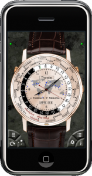

Just a quick note to update you on what we're doing at this moment:

- Our iPad app [Emerald Observatory](http://emeraldsequoia.com/eo/ "Emerald Observatory for the iPad") squeaked in under the wire (with 35 minutes to spare!) to make it into the store by iPad launch day (April 3).  That consumed most of our attention for the months of February and March.
- We've been putting the finishing touches on a "world time" watch for [Emerald Chronometer](http://emeraldsequoia.com/h/ "Emerald Chronometer"), which has a 24-city ring on the front and four 12-hour subdials on the back.  You can customize each of the 28 city locations via the Settings panel (much more quickly than sending it back to the factory for repainting!)

\- Steve

\[caption id="attachment\_20" align="aligncenter" width="157" caption="\*\*Preliminary\*\*"\]\[/caption\]
