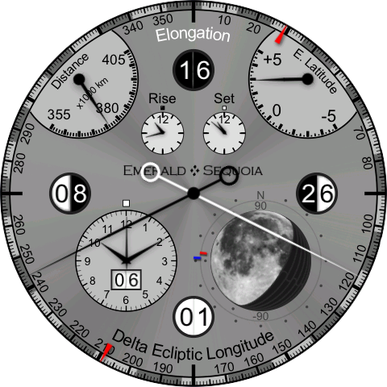
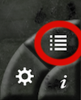

Bill & I have long had an unpublished app with a bunch of watch faces that we didn’t think were quite ready for the world to see. Some are unfinished, some are not up to our standards of polish, some are too similar to other faces, and some just seemed to have minimal value for the screen real estate that they take up. But now that we’re discontinuing the app anyway, we thought we’d leave them for you, “As Is”, to show you our in-progress work.

So the latest versions (3.12.2, probably rolling out today) of Emerald Chronometer and Emerald Chronometer for the iPad now include these new watch faces, making a total of 25, as something of a parting gift. My personal favorite is the back side of ChandraII, which has a much different take on data for the moon (those of you with the WearOS app may recognize it as Selene):

If the new watches aren’t your cup of tea, you can always disable them: Tap this button at the lower right:

Then in the list that comes up, tap Edit and remove the ones you’d prefer not to see every day:

To give a bit of extra time for this new version to roll out for everyone, these two apps (and only these two apps) will not be “unpublished” until Dec 15, 2023. The other apps are still on schedule to be delisted on November 1.

Thanks again for all of your support,

  Steve & Bill
