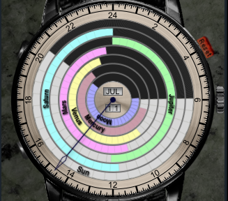
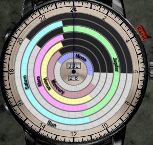
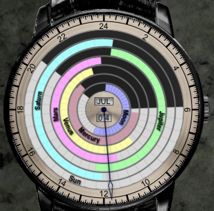
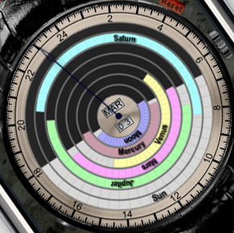
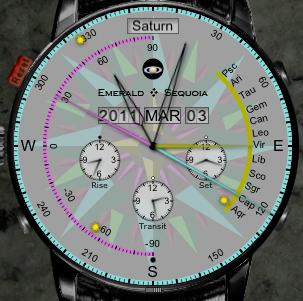

There are a couple of tricks with Emerald Chronometer's Miami front-side watch face that might not be obvious, so I thought I'd throw them out here:

## Moon Phase

The first is that you can tell the approximate phase of the moon with this display, by noting the relationship between Moon rise/set and Sun rise/set. From day to day, moonrise (and moonset) are later by about an hour, and thus the inner violet moon ring (see below) rotates (clockwise!) around the face of the watch. When the Moon ring is completely aligned with the gray "Sun is up section", it means they are rising and setting at the same time and thus the moon is new:

If the Sun and Moon indicators are opposite each other, it means the moon is full:

And you can judge approximately any other phase by noting how far around the Moon ring has rotated from complete alignment with the Sun. For example, in the following image, the Moon has passed full and is approximately at "third quarter":

## Position of planets in the sky

This one is a bit more hand-wavy and subjective. But it does work, at least in mid-latitudes in the northern hemisphere. If you rotate the watch face so that a particular planet's ring is centered at the top, with its rise on the left and its set on the right, and face south, then the 24-hour hand will point _approximately_ at the position along the ecliptic in the sky that the given planet can be found. This works because in this configuration the rise point on the watch face corresponds to left, meaning east when facing south, and the set point corresponds to right, meaning west. In the southern hemisphere mid-latitudes you would have to mirror the result around South. Here's an example, where we want to see where Saturn is approximately; the 24-hour hand points to its approximate position along the visible portion of the ecliptic:

Of course it's a lot easier to flip the watch around and use the other side to get the answer precisely :-) :

