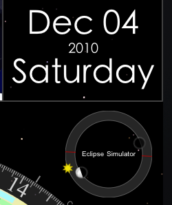
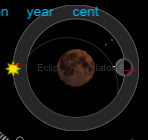
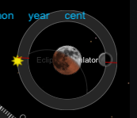

# Eclipses
**2010-12-16**

---

There will be a lunar eclipse later this month, visible in the Americas (a total eclipse, around midnight on the night of Dec 20-21, weather willing) and parts of Australia (partial eclipse just after sunset on the 21st) and Great Britain (partial eclipse just before sunrise on the 21st).

Emerald Chronometer (and Emerald Geneva) have had the capability to model eclipses for some time now, and there's a [web page about it](http://emeraldsequoia.com/h/Geneva/PredictingEclipses.html) in the Help and online. But we thought Emerald Observatory should have some of the fun, too. So we took that display from Geneva, simplified it a bit and shrunk it into the spot in Emerald Observatory previously occupied by the leap-year indicator:

The outer ring shows things that are apparently rotating around the Earth, namely the Sun, the Moon, the shadow of the Earth, and the nodal points of the lunar orbit, which are the points where it intersects the apparent orbit of the Sun. When the Moon and the Sun are at the same point on the display's ring, there is a new moon. A new moon does not always result in an eclipse, but if the new moon happens near a "nodal point" (red line on the ring), it means the orbital paths of the Sun and Moon are close to intersecting and a solar eclipse is possible. Similarly, when the Moon is opposite the Sun on the ring, it will be at the same point as the Earth shadow (black-filled circle) on the ring display, and there is a full moon. Again, a lunar eclipse does not always occur when there is a full moon, but again if the full moon happens near a nodal point (red line), then a lunar eclipse is possible.

When an eclipse of some sort happens, or even almost happens, the dial inside the ring shows a simulation of what will appear in the sky (with better graphics than on Geneva, since we aren't constrained here by the [mechanical model](http://emeraldsequoia.com/h/mmm.html)). For example, if we tap the Set button and then the phase button to advance to December (20th or) 21st, we see

The moon is shown eclipsed, and the Earth shadow is very faintly shown as a gray outline. If we move forward or backward in time, we can see the eclipse progress. Here we've moved backward an hour, to show the partial eclipse at that time:

As I said earlier, we removed the leap-year indicator. We moved the year itself next to the date (as shown in the top picture), and have a simple "Leap" indicator that turns on when there is a leap year, but the complex 1/2/3/4/100/400 display is gone. We were somewhat ambivalent about it from the start anyway, and at least one observer [agreed](http://www.macobserver.com/tmo/article/emerald_observatory_for_ipad_is_drop_dead_gorgeous/).

Anyway, here's wishing for clear skies for everyone. But if you can't see the eclipse outdoors, you'll be able to see it inside on Emerald Observatory. :-)

You'll need version 1.3 of Emerald Observatory to see it. It was approved for the store last night and should show up in the next 24 hours.
