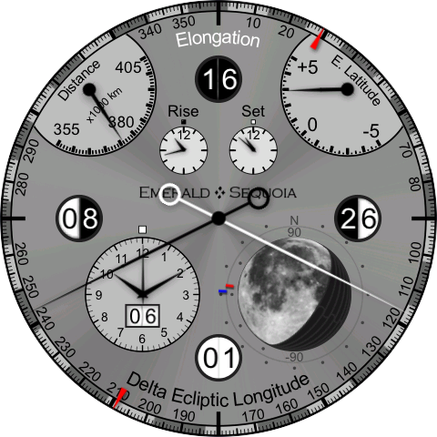
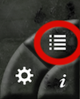
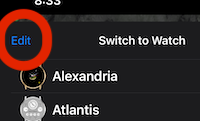

# Parting gift: Watches from the developers' workbench
**2023-10-23**

---

Bill & I have long had an unpublished app with a bunch of watch faces that we didn’t think were quite ready for the world to see. Some are unfinished, some are not up to our standards of polish, some are too similar to other faces, and some just seemed to have minimal value for the screen real estate that they take up. But now that we’re discontinuing the app anyway, we thought we’d leave them for you, “As Is”, to show you our in-progress work.

So the latest versions (3.12.2, probably rolling out today) of Emerald Chronometer and Emerald Chronometer for the iPad now include these new watch faces, making a total of 25, as something of a parting gift. My personal favorite is the back side of ChandraII, which has a much different take on data for the moon (those of you with the WearOS app may recognize it as Selene):

If the new watches aren’t your cup of tea, you can always disable them: Tap this button at the lower right:

Then in the list that comes up, tap Edit and remove the ones you’d prefer not to see every day:

To give a bit of extra time for this new version to roll out for everyone, these two apps (and only these two apps) will not be “unpublished” until Dec 15, 2023. The other apps are still on schedule to be delisted on November 1.

Thanks again for all of your support,

  Steve & Bill

## Comments (frozen)

**BigMcGuire 2023-10-24 22:02:25**

Thank you! :)

---

**RWK 2023-10-25 19:01:22**

Hi Steve Bill,

I want you to know how much I have appreciated Emerald & Sequoia from the beginning. Thank you for your wonderful watches and all the hard work which you have given to keeping them ticking.

Thank you also for the newly added watches which are such a refreshing blast to an already awesome app.

I hope some how these watches find a way to be around for years to come.

Lastly, I am a clock and watch fan, so if you do design another watch, please consider a Regulateur face with 12 classic Roman numerals on one side and 24 Arabic numerals on the other side.

Warmest wishes to you both, — Richard.

---

**ljs 2023-10-27 07:17:06**

Thank you for the wonderful parting gifts (especially Chandra II!). They are proof of the wonderful new clocks that you might have created had finances allowed you to carry on. We will miss you for all of time. Thanks for all the enhancements that you have brought to our lives. Best wishes, Larry

---

**david_wood@mac.com 2023-11-02 21:48:30**

I’m very sorry to see these apps removed from the App Store. Observatory was the first app on my original iPad in 2010. It is still the main go to application used in my observatory for locating solar system objects. I’ve had the other apps on board all of my devices for almost as long as they’ve been available.

I’m a volunteer docent for the Mount Palomar Observatory. When conducting tours for visitors, I ofttimes have my iPad with me, and show the current locations of the various solar system objects.

Thank you so much for the time and effort you put in to these high-quality apps.

---

**frankasperjr 2023-11-17 12:28:22**

This is the worst news I have heard since the Utah Stars folded. I have LOVED the Chronometer app for years and will continue to use and admire it until Apple decides to make it obsolete. (I wish they would quit doing that to good apps!) Then I will miss it very severely, as I use it almost every day. Chronometer is the perfect combination of science and art: it contains so much useful and interesting information and presents it so very accurately and BEAUTIFULLY. It is most useful especially when I am travelling. Each face is so much different from all the others, therefore the app as a whole contains incredible amounts of information. In another life, I would try to create full-size clocks of each of Chronometer’s faces and put them on walls all over my house. Thank you for sending us the new faces you have been working on: they are as beautiful as the previous ones and I love them, too. Thank you, thank you for such a gorgeous and utilitarian app, and I wish you all the best in your future endeavors.

---

**Kit 2023-11-19 12:00:18**

Steve and Bill, Again, a big thank you to you for your wonderful app over the years. Reading between the lines … will it still be possible to access or use any of your watches/clocks after the deadline? It sounds as though it may be possible??? Chris

---

**Wingnut 2023-11-25 05:21:21**

I registered just to say THANK YOU, THANK YOU and THANK YOU.

Your apps have been more than useful and fun for me, they have also made me think about the interface I was looking at.

I, for one, will miss the opportunity to see what else you may have come up with.

May God bless you in wherever this journey takes you. Godspeed

Cheers

---

**Wingnut 2023-11-25 05:28:27**

On a serious note, will the information/help page still be available from the app?

I use that really often.

---

**Steve 2023-11-25 12:53:34**

Good question. Here's the breakdown:

Chronometer for iOS (and its HD version) have always had in-app help that does not require a network, so those will be fine so long as the apps are (same for Geneva). This includes the entire help tree with the exception of the link to the blog.

Chronometer for WearOS depends on the website for its help files. If you also have Chronometer for iOS the help is nearly identical (except for the organization by faces instead of by watches). We do hope to have the website available via GitHub but I'm not sure about this yet.

Observatory has a single info page on the "backside" which is also in-app (and localized for language), and this too will be fine. The more detailed information available on the webpage at https://emeraldsequoia.com/eo/index.html will depend on the website staying up, but you could grab a copy of that web page now (from Safari, use "Save As" and choose the "Web Archive" format) since it's only one page.

Timestamp's help is a single page, also in-app so safe.

Emerald Time also has a single page, in-app help file, so also safe.

---

**tokyodave 2023-12-01 20:49:22**

My trusty, rusty, iPhone 7 Plus is still running on the original battery (!!) but I do think it’s time to upgrade, and I suddenly realized I absolutely need to buy my new phone before December 15, or I might never have my favorite Emerald Chronometer app on it! So, I have a hard deadline, and am starting to search for any deal I can find from the cell providers, or other stores here in Tokyo. Blessedly, I purchased a new iPad Air 5th gen last year, so hopefully the HD app and the fantastic, gorgeous Observatory app will continue to run on it for many years.

---

**wjruffing 2023-12-01 21:02:07**

I just wanted to say THANK YOU for your amazing apps (iOS). I have learned a lot about timekeeping by using them and it has sparked my curiosity to learn more about the topic and methodologies of accurate timekeeping. Having only scratched the surface on this topic so far (the rabbit hole goes very deep), I have come to appreciate just how much effort and expertise went into the development of this app.

Having just recently retired myself from an almost 40-year technology career, I wish you both the very best.

One last thought: Perhaps you might consider posting your work on GitHub as publicly-available OpenSource code so that the life of your creation can extend in new and even unexpected ways?

---

**555grim 2023-12-24 08:01:24**

Steve & Bill, I just wanted to say how much I’ve enjoyed Emerald Chronometer over the years, immensely so. In fact, my 4 and 6 year old daughters were beginning to get hooked through the Chandra watch as I taught them about the moon’s phases. I am so sad to think that someday the app will no longer work on my iPhone, and simply so sad to see you go. Thank you so much for creating this beautiful app! Best, Robert, Zeffi, and Fia

---
