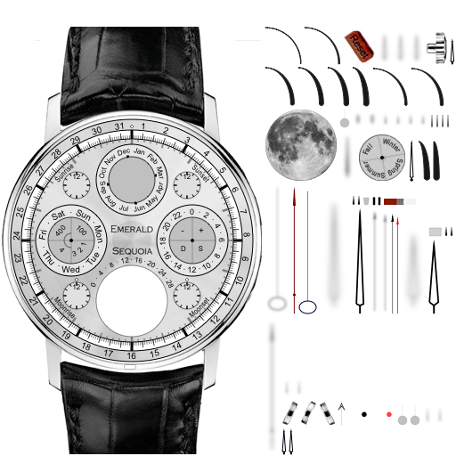
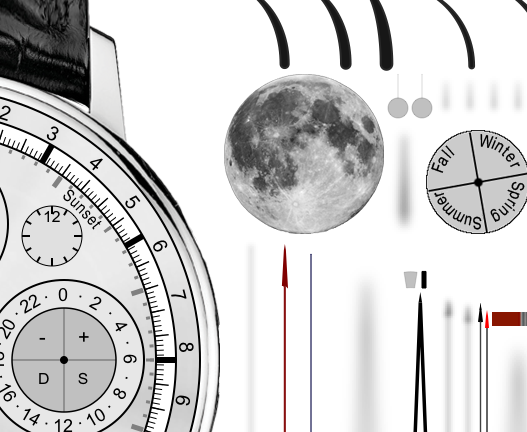
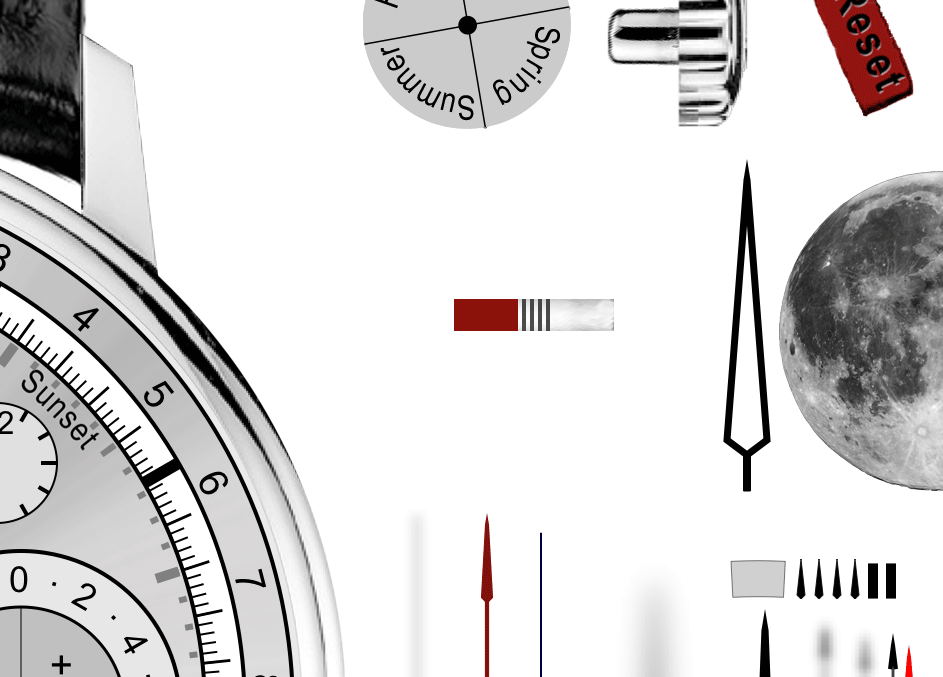

# Supporting the Retina iPad
**2012-06-16**

---

Version 3.8 of [Emerald Chronometer HD](http://emeraldsequoia.com/h/echd.html) has just been approved for the App Store, and fully supports the new iPad's Retina display.

Just as with [support for the iPhone 4's Retina display](http://emeraldsequoia.com/esblog/2010/11/08/retina-support-and-app-size/), adding this support required new artwork at double the resolution in each dimension, for a total of 4 times the pixels of the prior ECHD version.

And just as before, that means that the app download got a lot bigger; it's now 164 MB to hold all of the new artwork. For comparison, here's the artwork for the three kinds of display devices we support:

First the non-Retina iPhone and iPod touch: \[caption id="attachment\_54" align="aligncenter" width="512" caption="Old display texture atlas (\\"parts list\\")"\]\[/caption\]  

Next the Retina iPhone and iPod touch in Chronometer, and the iPad in Chronometer HD:   

Finally, the Retina iPad in Chronometer HD: 

We hope you enjoy it! As before, we sympathize with those of you on slow connections, but we used the same logic as before and decided we wanted this to be a free upgrade for ECHD users, which meant all ECHD users needed to upgrade.

Thanks for your support.

## Comments (frozen)

**robertgroess 2014-09-11 18:11:19**

Please make a customized version of Emerald Chronometer available for Apple Watch. I would pay (again!) to have the option of choosing those watch faces (even if they had to rely exclusively on the Apple time service instead of calculating an optimized time estimate from a bunch of different servers). Thank you for the awesome work!

---
