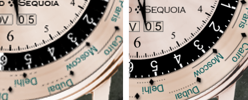

# iPhone 4 support
**2010-11-05**

---

We're about to release a new version of Emerald Chronometer with high-resolution graphics for the Retina display.  iPhone 3 users won't see much difference but iPhone 4 users will finally get the full benefit of their new screens.  It makes a huge difference, especially on all our small text:

